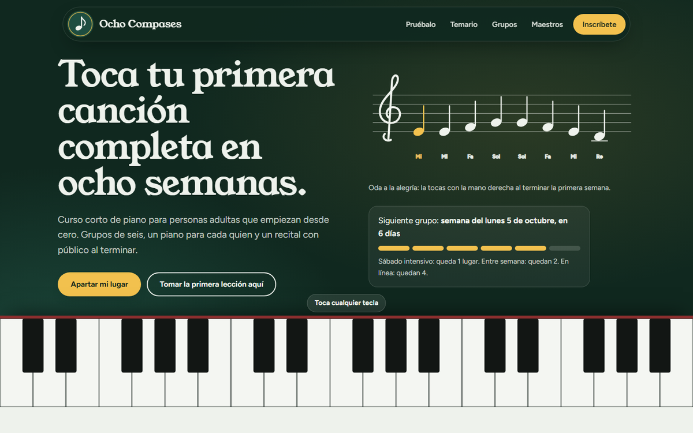
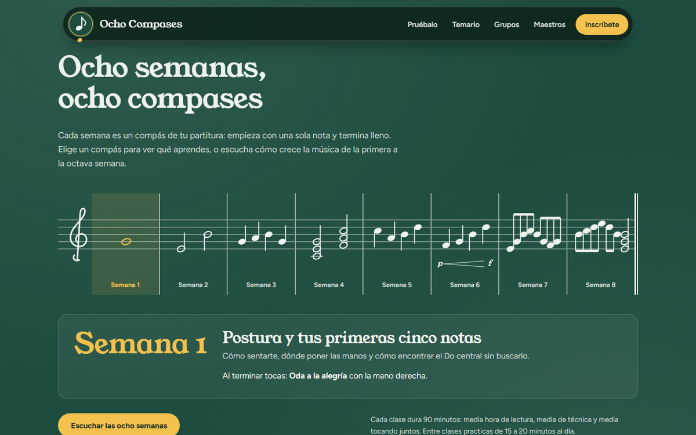
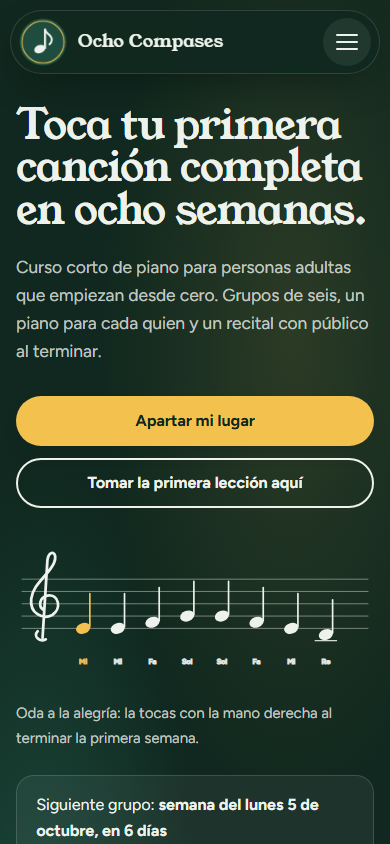

# Ocho Compases: curso corto de piano
| | |
|---|---|
| **Tema** | Curso corto (música) |
| **Técnica de canvas** | Logotipo en la barra de navegación |
| **Carpeta** | [`quinta pagina/`](../../quinta%20pagina/) |



## Canvas: logotipo en la barra de navegación

El `<canvas id="logo">` mide 56 × 56 px y está junto al nombre del sitio en la barra de navegación. Dibuja un círculo verde con un anillo amarillo y una **corchea** en el centro (una corchea es una "octava" de nota, igual que las ocho semanas del curso).

El logotipo reacciona a la página: el anillo late con cada pulso del metrónomo y la nota se ilumina cuando alguien toca una tecla. La barra tiene forma de cápsula, se compacta al bajar y muestra cuánto falta por leer.

El canvas usa `devicePixelRatio` para verse nítido y lee los colores de la paleta con `getComputedStyle`.

## Paleta

| Color | Hex | Uso |
|---|---|---|
| Verde pizarrón | `#1E4D40` | Círculo del logotipo, encabezado, secciones oscuras |
| Gis blanco | `#EEF2EC` | Fondo de la página, corchea del logotipo |
| Gis amarillo | `#F2C14E` | Anillo del logotipo, tecla que brilla, acentos |

**Tipografía:** Young Serif para los títulos y Figtree para el texto.

## Secciones y funciones

- **Portada:** un teclado a lo ancho de la pantalla que suena de verdad (Web Audio API). Cada tecla lanza una corchea que sube flotando. A un lado, la melodía de la primera semana escrita en un pentagrama y los lugares que quedan en el siguiente grupo.
- **Tu primera lección, ahora mismo:** un piano de dos octavas que se toca con el mouse, con el dedo o con el teclado de la computadora. Guía tres melodías tecla por tecla, dibuja cada nota en el pentagrama y puede tocar la melodía como ejemplo.
- **Ocho semanas, ocho compases:** el temario es una partitura de ocho compases que empieza con una sola nota y termina lleno. Cada compás es una pestaña con lo que se aprende esa semana. El botón "Escuchar las ocho semanas" toca la partitura completa mientras un cabezal la recorre.
- **Practica a tiempo:** metrónomo con péndulo animado, nombre del tempo en italiano y botón para marcar el pulso a mano.
- **Elige tu grupo:** tres horarios presentados como boletos de concierto, con las seis butacas de cada grupo. Al elegir uno, tu butaca se marca.
- **Quién te enseña**, **el recital** (un escenario donde el reflector sigue al mouse) y **preguntas frecuentes**.
- **Aparta tu butaca:** el boleto de inscripción se actualiza con cada opción. El curso cuesta ₡86 000 en un pago o dos pagos de ₡46 000, y el total cambia si se renta un teclado. Al terminar ofrece el recordatorio `.ics` de la primera clase.



## Estructura

```
quinta pagina/
├── index.html          redirige a public/index.html
├── css/estilos.css
├── js/pagina5.js
├── img/                6 ilustraciones SVG
└── public/index.html   la página
```

`public/index.html` enlaza su CSS y su JS subiendo un nivel: `../css/estilos.css` y `../js/pagina5.js`. Dentro de `public/` solo está el HTML, sin CSS ni JavaScript mezclados.

## Responsive

1. La etiqueta de viewport en el `<head>`:
   ```html
   <meta name="viewport" content="width=device-width, initial-scale=1.0">
   ```
2. El canvas nunca es más ancho que su contenedor y su alto se ajusta en proporción:
   ```css
   canvas {
     max-width: 100%;
     height: auto;
   }
   ```
3. Al final de `css/estilos.css`, una media query para pantallas de menos de 640 px que acomoda el menú y los boletos de los grupos en una sola columna:
   ```css
   @media (max-width: 639px) {
     .nav__lista { flex-direction: column; }
     .boletos { grid-template-columns: minmax(0, 1fr); }
   }
   ```



## Cómo verla

No necesita servidor ni instalación. Abre con doble clic el `index.html` de la carpeta `quinta pagina`. Para escuchar el piano, sube el volumen: el sonido empieza después del primer clic o toque, como exigen los navegadores.

Las tipografías se cargan desde Google Fonts, así que se ve mejor con conexión a internet. Sin conexión, el navegador usa fuentes del sistema.

## Tecnologías

- **HTML5:** estructura semántica, pestañas accesibles para el temario, formularios accesibles
- **CSS3:** variables, Grid, Flexbox, `clamp()`, `mask-composite` para las muescas de los boletos, `perspective` para inclinarlos, `:has()`, animaciones ligadas al scroll (`animation-timeline`), animaciones y transiciones
- **JavaScript sin librerías:** Canvas 2D, Web Audio API (piano, metrónomo y partitura), Web Animations API, `IntersectionObserver`, `localStorage` y archivos `.ics` generados en el navegador
- **SVG:** 6 ilustraciones hechas para este sitio

## Notas

- La escuela, las personas, la dirección, el teléfono y el correo son **ficticios**.
- Los precios están en **colones costarricenses (CRC)** con el formato de Costa Rica, por ejemplo ₡86 000. El navegador los genera con `Intl.NumberFormat('es-CR', { currency: 'CRC' })`.
- Los formularios no envían datos a ningún servidor. Al terminar, abren la aplicación de correo con el mensaje listo y lo avisan en pantalla. Las butacas apartadas se guardan solo en el navegador de quien visita.
- Las animaciones respetan la opción de **reducir movimiento** del sistema operativo. La página se puede recorrer con el teclado, y el piano también se toca con él.
- Las animaciones ligadas al scroll son una función reciente del navegador. En navegadores que no la tienen, la página funciona igual, sin ese efecto.

---

Proyecto académico de Desarrollo Web I.
